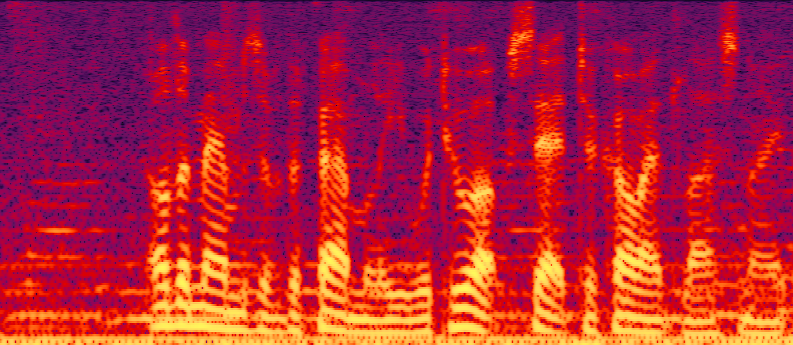
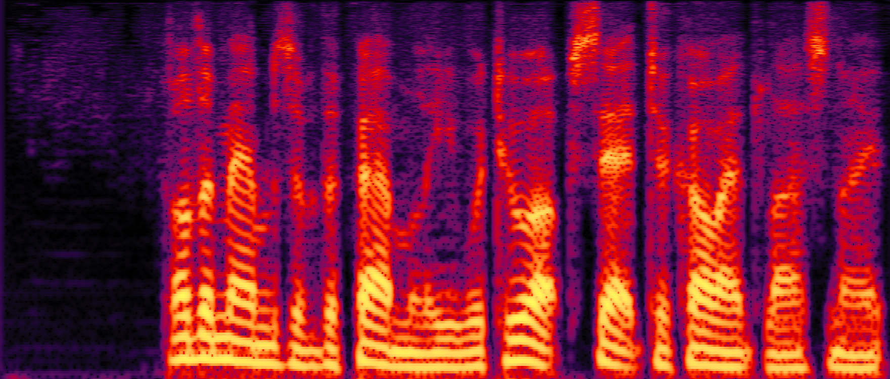

**DPCRN** 

------------------------

An unofficial Pytorch implementation of DPCRN model.

#### 1.Demo

noisy speech:



enhancement speech:



#### 2.Train

To train the model, **first** change the `folder` variable value of `load_data_list()` function in `se_dataset.py`, **then** run :

```
python train.py --batch_size 8 --num_epochs 100
```

#### 3.Infer

To denoise the noisy speech, run:

```
python infer.py --ckp_path ./pretrained_model/final_ckp.pth --audio_path your_noisy_speech_path --save_path your_enhancement_speech_save_path
```

#### 4.Pretrained model

A pretrained model which trained on **VCTK-Demand** dataset can be found in  `pretrained_model` folder.

#### 5.References

[1]https://github.com/Le-Xiaohuai-speech/DPCRN_DNS3

[2]https://github.com/chanil1218/DCUnet.pytorch
